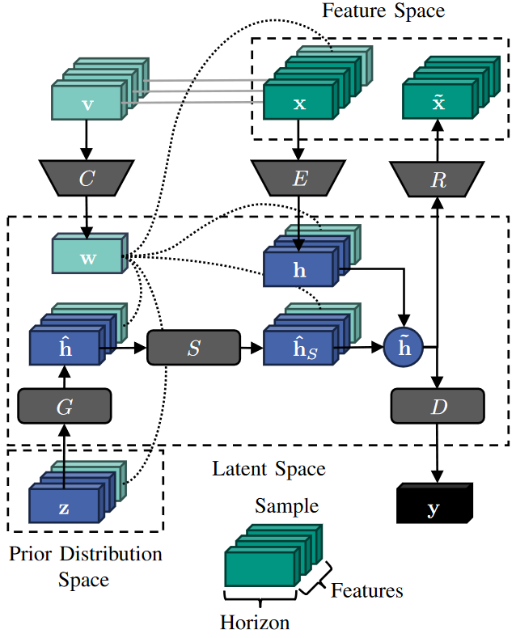

<p float="left">
     
</p>

[](https://www.python.org/downloads/release/python-3918/)
[](./LICENSE)
[](https://github.com/psf/black)
[](goekhan.demirel@kit.edu)
[](https://doi.org/10.1109/iSPEC59716.2024.10892479)

<h1 align="center">Synthesizing Distribution Grid Congestion Data Using Multivariate Conditional Time Series Generative Adversarial Networks</h1>

**⚠️ Note**: _Last update on 09.07.2025_

The Multivariate Conditional Time-series Generative Adversarial Networks (MC-TimeGAN) is a generative model designed to synthesize multivariate conditional time series. It extends the [TimeGAN](https://github.com/jsyoon0823/TimeGAN) framework to generate synthetic time-series data in a conditional manner, focusing on grid congestion multivariate time series for a power distribution grid by modifying labels.



## Compatibility

MC-TimeGAN has been tested and works with the following versions of PyTorch:

- PyTorch version: `2.2.0+cu121` (GPU)
- PyTorch version: `2.3.1+cpu` (CPU)

## Usage Command Line

<details>
  <summary>Click to expand/collapse</summary>

Run the MC-TimeGAN training and data generation with default arguments by using the **[**main**.py](__main__.py)** script directly from the command line:

- Example bash script to run **[**main**.py](__main__.py)** with default values

```bash
python __main__.py --data "helper/data/raw/feeder_sgens_4w_data.csv"  --labels "helper/data/raw_labels/feeder_sgens_4w_labels_ordinal.csv"  --horizon 96 --hidden_dim 24 --num_layers 3 --epochs 2000 --batch_size 128 --learning_rate 1e-3 --csv_filename "helper/synthetic_data/main_mctimegan_synthetic_sgen_data.csv"
```

- or outside the MC-TimeGan folder

```bash
python MC-TimeGAN --data "helper/data/raw/feeder_sgens_4w_data.csv"  --labels "helper/dat
a/raw_labels/feeder_sgens_4w_labels_ordinal.csv"  --horizon 96 --hidden_dim 24 --num_layers 3 --epochs 2000 --batch_size
128 --learning_rate 1e-3 --csv_filename "helper/synthetic_data/main_mctimegan_synthetic_sgen_data.csv"
```

## Arguments:

| Argument          | Type  | Default Value                                                                                                            | Help                                            |
| ----------------- | ----- | ------------------------------------------------------------------------------------------------------------------------ | ----------------------------------------------- |
| `--data`          | str   | `helper\data\raw\feeder_sgens_4w_data.csv`, `helper\data\raw\feeder_loads_4w_data.csv`                                   | Path to the data file                           |
| `--labels`        | str   | `helper\data\raw_labels\feeder_sgens_4w_labels_ordinal.csv`, `helper\data\raw_labels\feeder_loads_4w_labels_ordinal.csv` | Path to the labels file                         |
| `--horizon`       | int   | `96`                                                                                                                     | Horizon for sequence slicing                    |
| `--hidden_dim`    | int   | `24`                                                                                                                     | Hidden dimension size for the model             |
| `--num_layers`    | int   | `3`                                                                                                                      | Number of layers in the model                   |
| `--epochs`        | int   | `2000`                                                                                                                   | Number of training epochs                       |
| `--batch_size`    | int   | `128`                                                                                                                    | Batch size for training                         |
| `--learning_rate` | float | `1e-3`                                                                                                                   | Learning rate for training                      |
| `--csv_filename`  | str   | `mctimegan_synthetic_data.csv`                                                                                           | Filename for the exported CSV of synthetic data |

</details>

## Replicating Results

<details>
  <summary>Click to expand/collapse</summary>

To replicate the results from the paper, follow these steps:

1. Clone the repository:
   ```bash
   git clone git@github.com:KIT-IAI/MC-TimeGAN.git
   ```
2. Navigate to the cloned directory:
   ```bash
   cd MC-TimeGAN
   ```
3. Run the following command to install the packages:
   ```bash
   pip install -r requirements.txt
   ```
4. To train and generate data using the MC-TimeGAN framework, simply run the Jupyter notebook tutorial:
   - **[run_mctimegan_training_and_data_generation_tutorial.ipynb](run_mctimegan_training_and_data_generation_tutorial.ipynb)**
5. For label generation on original data, modification of labels, and comparison between original and synthetic data, run:
   - **[run_mctimegan_label_generation_and_evaluation_tutorial.ipynb](run_mctimegan_label_generation_and_evaluation_tutorial.ipynb)**

## Repository Structure

```plaintext
MC-TimeGAN/
├── __main__.py
├── helper/
│   ├── data/
│   │   ├── modify_labels/
│   │   ├── raw/
│   │   └── raw_labels/
│   ├── img/
│   ├── models/
│   ├── synthetic_data/
│   ├── data_processing.py
│   ├── evaluation_processing.py
│   ├── grid_manager.py
│   ├── label_processing.py
│   ├── mctimegan.py
│   └── metrics.py
├── LICENSE
├── README.md
├── requirements.txt
├── run_mctimegan_label_generation_and_evaluation_tutorial.ipynb
└── run_mctimegan_training_and_data_generation_tutorial.ipynb
```

</details>

## License

This code is licensed under the [MIT License](LICENSE).

<h2>Citation &#128221;</h2>
<p>
If you use this framework in your research, please consider citing our paper &#128221; and giving the repository a star &#11088;:
</p>

#### BibTeX format

```tex
@INPROCEEDINGS{Demirel2024,
  author={Demirel, Gökhan and Hauf, Jan and Butt, Hallah and Förderer, Kevin and Schäfer, Benjamin and Hagenmeyer, Veit},
  booktitle={2024 IEEE Sustainable Power and Energy Conference (iSPEC)},
  title={Synthesizing Distribution Grid Congestion Data Using Multivariate Conditional Time Series Generative Adversarial Networks},
  year={2024},
  volume={},
  number={},
  pages={385-390},
  keywords={Deep learning, distribution grid congestion, generative models, multivariate time series, photovoltaic power systems},
  doi={10.1109/iSPEC59716.2024.10892479}}
```

## Contact

For any questions or inquiries, please contact goekhan.demirel@kit.edu.
